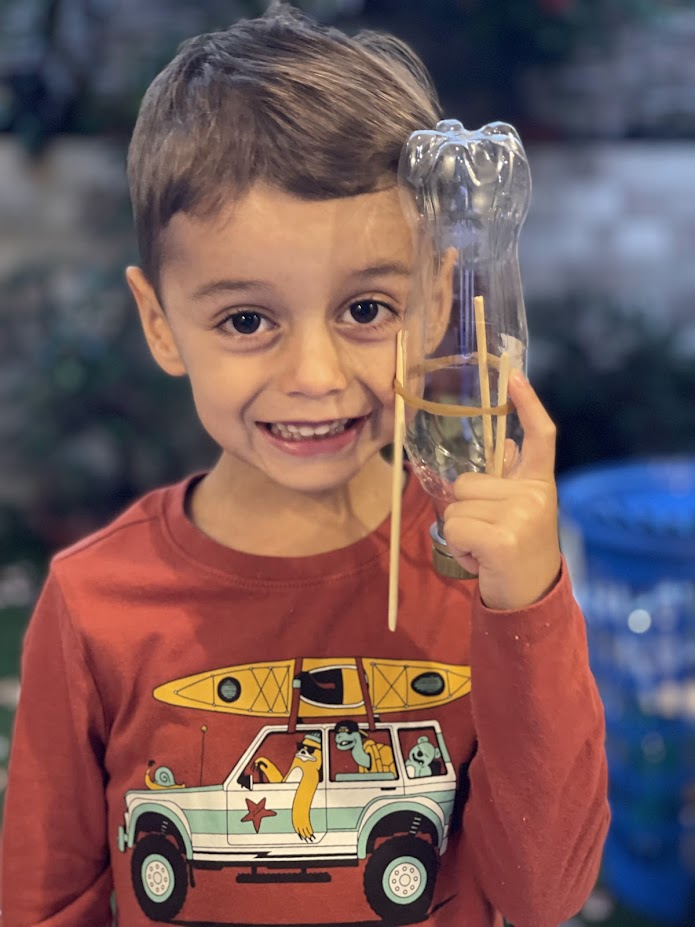
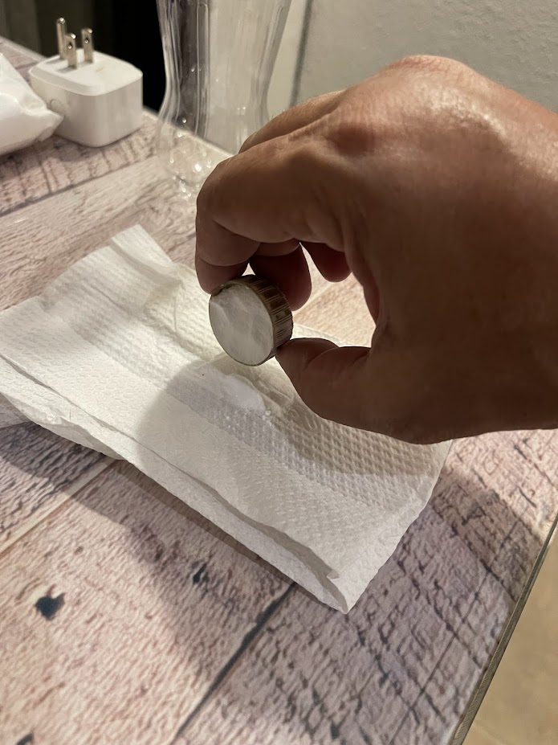
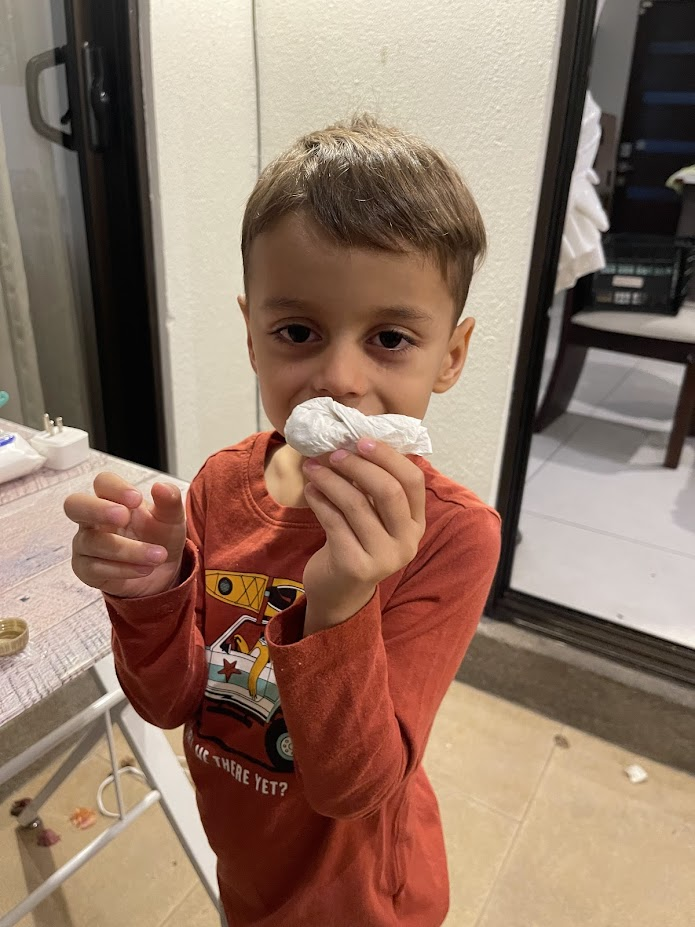
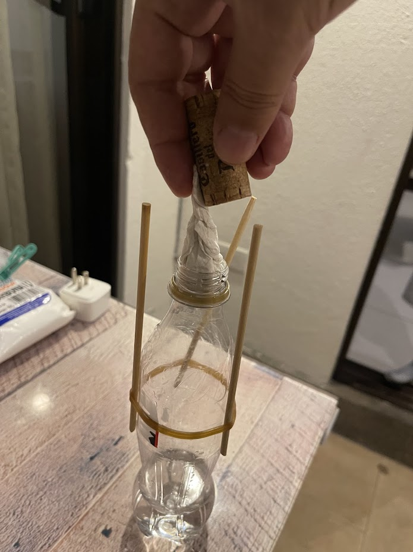
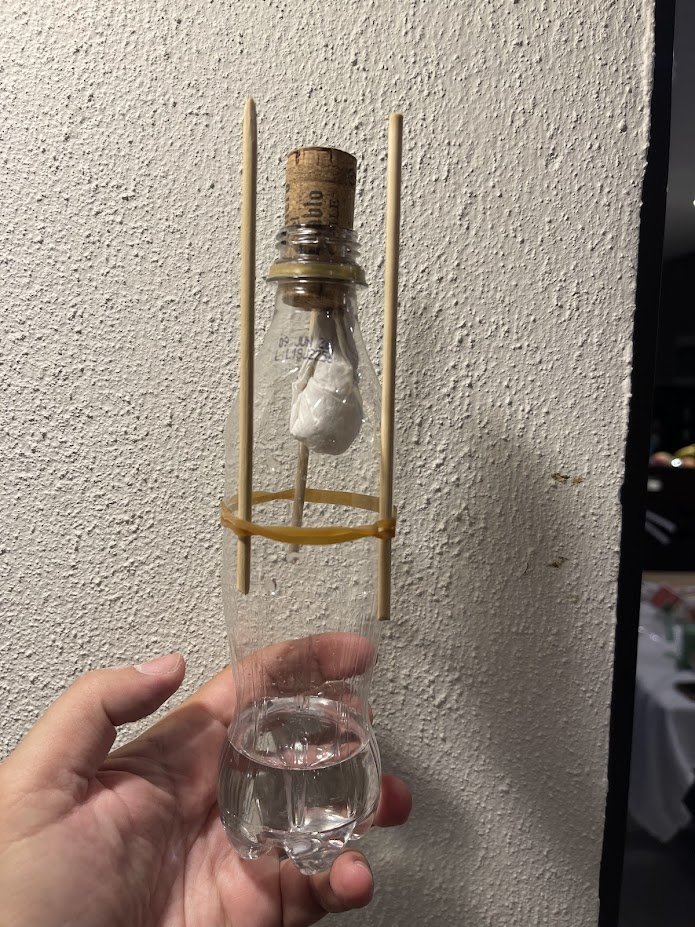

  

# Sebas Rockets :rocket:

**Welcome, rocket scientist!** You just got your very own **Sebas Rocket Kit**!
Follow these easy steps to build and launch your rocket. Let's go! :star2:

---

## What's in Your Kit? :package:

Your kit comes with everything you need:

| Item | What It's For |
|:-----|:--------------|
| :baby_bottle: **Plastic bottle** | The rocket body — already filled with vinegar! |
| :cup_with_straw: **Vinegar** (inside the bottle) | Liquid fuel |
| :cookie: **Baking soda** | Powder fuel — when it mixes with vinegar… BOOM! |
| :chopsticks: **3 wooden sticks** | The rocket legs |
| :knot: **Rubber band** | Holds the legs onto the bottle |
| :wine_glass: **Cork** | Seals the bottle so pressure builds up |
| :roll_of_paper: **Paper napkin** | For wrapping the baking soda |

---

## How Does It Work? :boom:

When **vinegar** and **baking soda** mix together, they create a gas called
**carbon dioxide** (CO₂). The gas builds up pressure inside the bottle until…
**POP!** :boom: The cork shoots out and the rocket flies up into the sky!

!!! question "Why does it fly?"
    It's the same idea real rockets use! Gas pushes down,
    and the rocket goes **UP**. Scientists call this **Newton's Third Law**:
    *for every action, there is an equal and opposite reaction.* :bulb:

---

## Step-by-Step Instructions :hammer:

### Step 1 — Attach the Legs :one:

Place the **3 wooden sticks** around the bottle and hold them in place with
the **rubber band**. These are your rocket's landing legs!

<figure markdown="span">
  { width="400" }
  <figcaption>Wrap the rubber band tight so the sticks don't move!</figcaption>
</figure>

---

### Step 2 — Add Baking Soda to the Napkin :two:

Open the **paper napkin** flat on a table. Pour the **baking soda** onto the
center of the napkin.

<figure markdown="span">
  { width="400" }
  <figcaption>Put all the baking soda right in the middle.</figcaption>
</figure>

---

### Step 3 — Wrap It Up :three:

Fold and roll the napkin around the baking soda to make a little **packet**.
Make sure it's small enough to fit through the bottle opening!

<figure markdown="span">
  { width="400" }
  <figcaption>Roll it up nice and tight!</figcaption>
</figure>

---

### Step 4 — Load the Rocket :four:

Push the **baking soda packet** into the bottle and quickly seal it with the
**cork**. The vinegar is already inside — don't shake it yet!

<figure markdown="span">
  { width="400" }
  <figcaption>Push the cork in firmly so no gas escapes!</figcaption>
</figure>

---

### Step 5 — Launch! :five:

Now for the fun part!

1. **Shake** the bottle so the vinegar soaks through the napkin
2. **Flip** the rocket upside down (legs pointing up!)
3. **Place** it on the ground with the cork facing down
4. **Step back** and wait…

**3… 2… 1…** :boom: **BLAST OFF!**

<figure markdown="span">
  { width="400" }
  <figcaption>Stand back and watch it fly! :rocket:</figcaption>
</figure>

---

## Safety First! :helmet_with_cross:

!!! warning "Always build and launch with a grown-up!"
    - :white_check_mark: Launch **outside** in an open area
    - :white_check_mark: **Stand back** after placing the rocket on the ground
    - :white_check_mark: **Never** point the rocket at people or animals
    - :white_check_mark: Wear old clothes — it can get messy and that's part of the fun!

---

Made with :heart: by **Sebas** · Market Day 2026

*Scanned the QR code on your kit? You're in the right place!*

